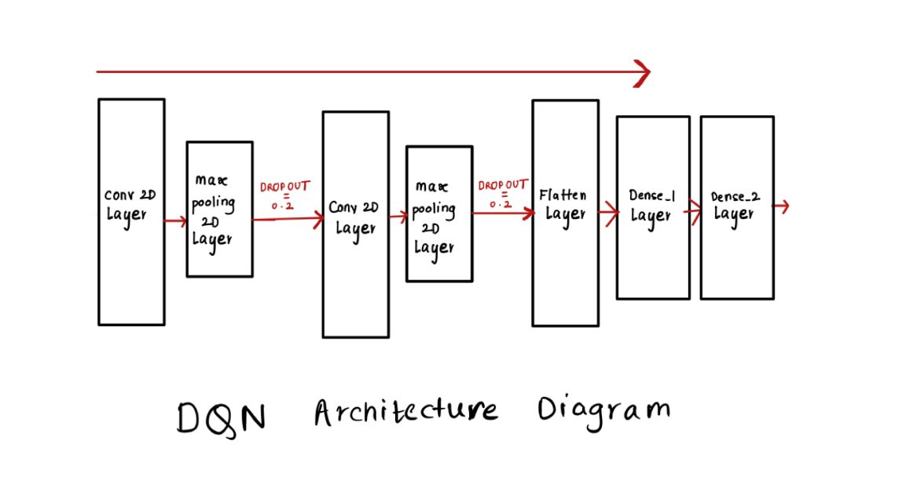
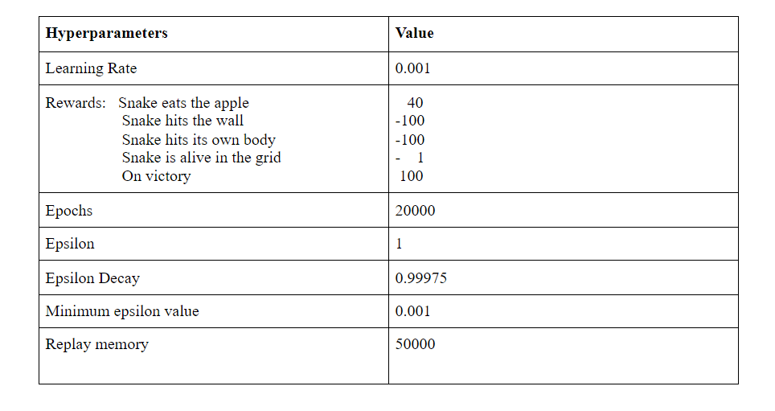

# Deep-Q-Learning-Snake-Game

The aim of this project is to apply Deep Q-Learning techniques to implement from scratch- the famous game -”Snake”. Essentially, we want to train an agent in an environment of states and actions with the aim of maximizing the reward while avoiding negative rewards.In this project, we are controlling an agent- a snake in a grid environment, that eats apples and when it does it gains a reward & grows in size. The snake is allowed to move freely around the playing field but the game is over if the snake hits the walls or itself. Based on the reward the agent learns how to play the game. DQNs use Q-learning to learn the best action to take in a given state (the Q-value), and use ConvNets as a function approximator for the Q-learning function. 

Below, are the hyperparameters used in the training procedure:

Below, are the hyperparameters used in the training procedure:

The file `snake.py` is the game environment and consists of the grid, the snake, the position of the food and the rewards recieved on taking certain actions.

The file `DeepQAgent.py` defines the model used to train the game snake.

The file `run.py` contains the code for training the network. 

The file `ModifiedTensorBoard.py` is used to get the logs for the rewards achieved by the snake.

## Steps:
Run `python run.py` to start the traing procedure.

